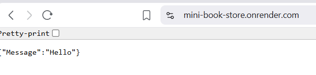
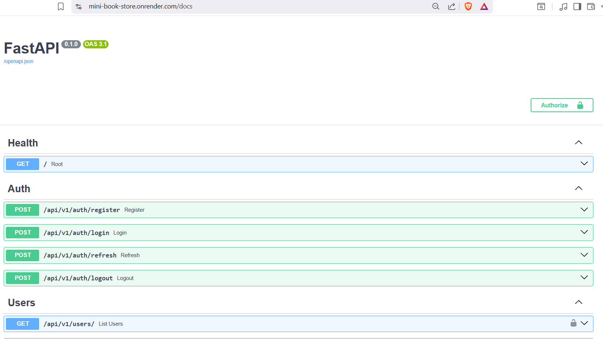

## Mini Book Store

A backend RESTful API for a book store system built with FastAPI and Postgre SQL.

This project demonstates authentication, CRUD operations, Dockerized development and CI/CD integration using GitHub Actions.

## 📌 Description

This project is designed as a learning-oriented backend system that simulates a simple book store.

It provides APIs for managing books and users, along with authentication using JWT.

The goal of this project is to practice:

    - Backend architecture desgin
    - API development with FastAPI
    - Database interaction using SQLAlchemy
    - Containerization with Docker
    - CI/CD pipeline setup


## ⚙️ Setup & Installation

1. Clone repository

```bash
 git clone https://github.com/LeHoangG-Dev/mini-book-store.git
```

```bash
cd mini-book-store
```

2. Create environment file

Create a .env.dev and .env.test for testing in the root directory (You can see the key in .env.dev.example and .env.test.example)

```bash
touch .env.dev .env.test

cp .env.dev.example .env.dev
cp .env.test.example .env.test

```

Example generate secrey-key:
```bash
openssl rand -hex 32
```

Copy your key generated to .env.dev and .env.test

3. Run with Docker (Docker must be installed in host)

```bash
docker compose build
docker compose up -d
```

4. Access API

Swagger UI:

http://localhost:80/docs

5. Stop services

```bash
docker compose down -v
```

## 🧪 Running Tests

Run tests using Docker:

Remember to stop the dev container first

```bash
docker compose -f docker-compose.test.yml build --no-cache

docker compose -f docker-compose.test.yml up -d 

docker compose -f docker-compose.test.yml exec app pytest -v

docker compose -f docker-compose.test.yml down -v
```

## 🚀 Features

- JWT Authentication (Access & Refresh Token)
- User management
- Book CRUD environment
- Dockerized environment
- Environment-based configuration
- Automated testing with Pytest
- CI pipeline with GitHub Actions

## 🛠️ Tech Stack

- Backend: FastAPI
- Database: PostgreSQL
- ORM: SQLAlchemy
- Validation: Pydantic
- AuthenticationL JWT
- Containerization: Docker, Docker Compose
- Testing: Pytest
- CI/CD: GitHub Actions

## 📂 Project Structure
    app/
    |--main.py
    |--core/
    |--models/
    |--routers/
    |--schemas/
    |--services/


## 🔐 Environment Variables

#ORM
DB_USER : Database user
DB_NAME : Database name
DB_PASSWORD: Database password

DB_TEST_NAME: Database test name (If testing)

#Database
POSTGRES_USER: Postgre user
POSTGRES_DB: Postgre database name
POSTGRES_PASSWORD: Postgre password

#HOST
DB_HOST: Database host
DB_PORT: Database port

#Security
ALGORITHM: JWT algorithm
SECRET_KEY: JWT secret key

#Tokens
ACCESS_TOKEN_EXPIRE_MINUTES
REFRESH_TOKEN_EXPIRE_DAYS

#App
DEBUG: Debug mode

#Admin
ADMIN_EMAIL: admin account
ADMIN_PASSWORD: admin password

## 📡 API Endpoints 

Health


GET
/
Root

Auth
POST
/api/v1/auth/register

POST
/api/v1/auth/login

POST
/api/v1/auth/refresh

POST
/api/v1/auth/logout

Users
GET
/api/v1/users/

GET
/api/v1/users/me

PUT
/api/v1/users/me

PUT
/api/v1/users/me/password

Books
GET
/api/v1/books/

POST
/api/v1/books/

GET
/api/v1/books/{id}

PUT
/api/v1/books/{id}

DELETE
/api/v1/books/{id}

Carts
GET
/api/v1/cart/

POST
/api/v1/cart/items

PUT
/api/v1/cart/items/{book_id}

DELETE
/api/v1/cart/items/{book_id}

Orders
POST
/api/v1/orders/checkout

GET
/api/v1/orders/

GET
/api/v1/orders/{order_id}

PATCH
/api/v1/orders/{order_id}/cancel

PATCH
/api/v1/orders/{order_id}/received

PATCH
/api/v1/orders/admin/{order_id}/confirm

PATCH
/api/v1/orders/admin/{order_id}/ship

PATCH
/api/v1/orders/admin/{order_id}/shipped

PATCH
/api/v1/orders/admin/{order_id}/cancel


## 🤝 Contributing

1. Fork the repostiry
2. Create a new branch
3. Commit your changes
4. Open a Pull Request

## Demo

Deploy with Render:
Root:


Docs:



## 📄 License

This project is for learning and demonstration purposes.